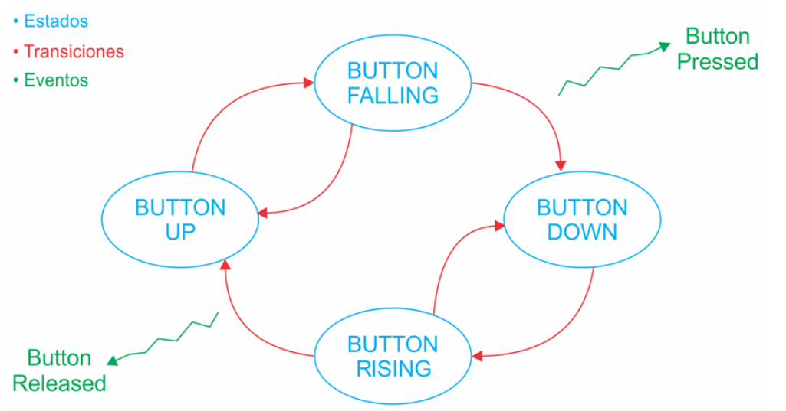

# Practica 3

Este ejercicio implementa una MEF (Maquina de Estados Finita) anti-rebote que
permita leer el estado de un pulsador de la placa NUCLEO-F446RE y generar
acciones o eventos ante un flanco descendente o ascendente, de acuerdo al
siguiente diagrama.



El tiempo anti-rebote es de 40mS con un retardo no bloqueante utilizando la
libreria `Drivers/API/API_delay.(c|h)`.

La misma se encuentra definida bajo los archivos `Drivers/API/API_debounce.(c
|h)` e implementa las siguientes funciones y tipos de datos:


```
/**
 * @brief representation of each state of the FSM
 */
typedef enum {
	BUTTON_UP,			///< The button is up after 40mS of rising edge detected
	BUTTON_FALLING,		///< A falling edge has been detected
	BUTTON_DOWN,		///< delay of 40mS passed and logic level of button is low, FSM passed to BUTTON_DOWN
	BUTTON_RISING		///< A rising edge has been detected, waiting for delay 40mS and button up so FSM transitions to BUTTON_UP
} debounceState_t;

/**
 * @brief load initial state
 * 
 * This function initializes the debounce FSM by setting the initial state to
 * BUTTON_UP and initializing the debounce delay timer.
 * It should be called once at the start of the program.
 */
void debounceFSM_init();

/**
 * @brief update FSM according to inputs
 * 
 * This function should be called periodically in the main loop to update the
 * state of the FSM based on the button input and timing. It checks the current
 * state and transitions to the next state based on the button's logic level and
 * the debounce delay.
 */
void debounceFSM_update();

/**
 * @brief public function to get key value
 *
 * @return true if the button was pressed, false otherwise
 * @note this function will return true only once per button press, it resets
 * the keyPressed variable after reading it
 */
bool_t readKey();
```


## Ejemplo

Dentro de `main.c` se muestra un ejemplo de como implementar la FEM. Este
ejemplo, hace parpadear un LED con un duty cycle del 50% y cada vez que se
presiona el boton, la frecuencia de parpadeo se modifica entre 100mS y 500mS.


## Compilacion

Usando STM32CubeIDE, importar este proyecto y hacer click en el martillo para
compilar y despues en el boton de "play" para correr sobre la placa.
