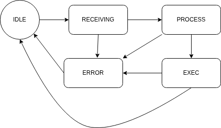

# Practica 5

Este ejercicio implementa dos módulos de software sobre la placa NUCLEO-F446RE
para recibir y ejecutar comandos por UART en **modo polling** (sin
interrupciones ni DMA), usando la HAL de STM32.

---

## Módulos

### `Drivers/API/API_uart.(c|h)`

Capa de acceso a la UART. Expone las siguientes funciones públicas:

```c
uart_status_t uartInit();
void          uartSendString(char *pstring);
void          uartSendStringSize(char *pString, uint16_t size);
uart_status_t uartReceiveStringSize(char *pstring, uint16_t size);
uint32_t      uartGetBaudrate();
uart_status_t uartSetBaudrate(uint32_t baudrate);
```

`uartInit()` inicializa el periférico y envía por la terminal un mensaje con
los parámetros de configuración (baudrate, bits de datos, paridad, stop bits).
`uartSetBaudrate()` valida que el baudrate esté dentro del rango soportado
(9600 – 921600) y reinicia la interfaz. `uartReceiveStringSize()` opera con
timeout cero: retorna inmediatamente si no hay datos disponibles, sin bloquear
el superloop.

Los baudrates soportados son: 9600, 38400, 57600, 115200, 230400, 460800,
921600.

---

### `Drivers/API/API_cmdparser.(c|h)`

Parser de comandos implementado como una MEF (Máquina de Estados Finita) de 5
estados:



| Estado          | Descripción                                                    |
|-----------------|----------------------------------------------------------------|
| `CMD_IDLE`      | Espera el primer carácter válido de una nueva línea            |
| `CMD_RECEIVING` | Acumula caracteres en un buffer hasta recibir `\r`, `\n`       |
| `CMD_PROCESS`   | Tokeniza la línea y busca el comando en la tabla registrada    |
| `CMD_EXEC`      | Ejecuta la función asociada al comando                         |
| `CMD_ERROR`     | Imprime el mensaje de error correspondiente y reinicia el FSM  |

**Reglas de protocolo:**

- La línea termina con `\r`, `\n` o `\r\n`.
- Múltiples espacios o tabs consecutivos se ignoran.
- Líneas que empiecen con `#` o `//` son tratadas como comentarios (error
  `CMD_ERR_IGNORED`).
- Las respuestas siempre terminan con `\r\n`.

**Mensajes de error:**

```
ERROR: line too long
ERROR: comments starting with # or // are not accepted
ERROR: wrong syntax
ERROR: unknown command
ERROR: received end-of-line
ERROR: bad arguments
```

Las funciones públicas son:

```
void cmdParserInit(const cmd_t *custom_cmds, size_t num_cmds);
void cmdPoll(void);
```

`cmdParserInit()` registra la tabla de comandos. `cmdPoll()` debe llamarse
periódicamente desde el superloop; procesa hasta **16 bytes por invocación**
sin bloquear: en cada llamada lee caracteres disponibles en un loop interno y
sale en cuanto la UART no tiene más datos o se alcanza el límite de iteraciones.

Los comandos se registran mediante el tipo `cmd_t`:

```
typedef struct {
    char cmd[CMD_MAX_LINE];
    char desc[MAX_TX_SIZE];
    cmd_status_t (*func)(const char args[][CMD_MAX_LINE/3], uint8_t arg_count);
} cmd_t;
```

## Comandos disponibles

| Comando          | Descripción                                              |
|------------------|----------------------------------------------------------|
| `LED ON`         | Enciende el LED2 de la placa                             |
| `LED OFF`        | Apaga el LED2                                            |
| `LED TOGGLE`     | Conmuta el estado del LED2                               |
| `STATUS`         | Imprime `LED is ON` o `LED is OFF`                       |
| `BAUD=<value>`   | Cambia el baudrate y reinicia la UART (9600 – 921600)    |
| `BAUD?`          | Imprime el baudrate actual                               |
| `HELP`           | Lista todos los comandos disponibles con su descripción  |

Los comandos son case-insensitive.

## Compilacion

Usando STM32CubeIDE, importar este proyecto y hacer click en el martillo para
compilar y despues en el boton de "play" para correr sobre la placa.

Para interactuar con la placa, conectarse al puerto serie a 115200 baud (8N1)
con cualquier terminal serie (minicom, PuTTY, etc.) y enviar comandos
terminados en `\r\n`.
